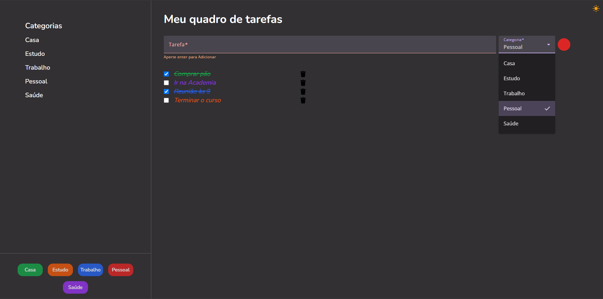

# Gerenciador de Tarefas
Este é um **Gerenciador de Tarefas (To-Do List)** desenvolvido com **Angular**, **Tailwind CSS**, **TypeScript** e um backend simulado com **JSON Server**.



## Tecnologias Utilizadas
-   **Angular** 
    
-   **Tailwind CSS**
    
-   **TypeScript**
    
-   **JSON Server** 

## Funcionalidades

-   ✅ Adicionar novas tarefas
-   ✅ Anexar categorias a tarefas
-   ✅ Editar tarefas
-   ✅ Marcar tarefas como concluídas
-   ✅ Excluir tarefas

## Como Rodar 
### Pré-requisitos:
-   Node.js 
-   Angular CLI 
-   JSON Server 

1. **Clone o repositório:**
   ```bash
   git clone https://github.com/gxstavomiguel/task-board
2. **Abra o projeto no Visual Studio Code.**

3. **Rode os servidores:**
``
	ng serve & npm run server
   ``

4. **Inicie o projeto.**
   ```bash 
   A aplicação estará disponível em: http://localhost:4200

